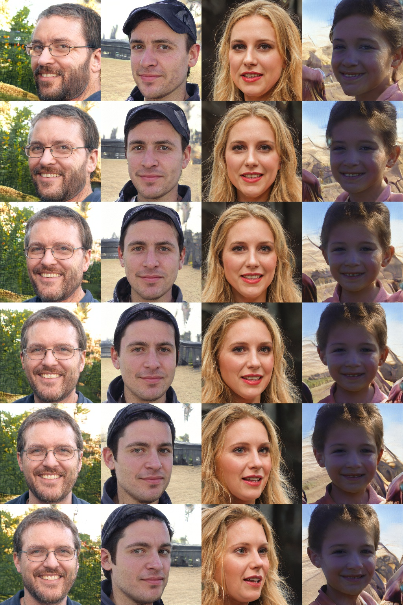

## Face_editting
Experiments with face editting along axis in latent space with StyleGAN &mdash;
I reconstructed stylegan`s work from several repositories for generated and real images, combine them, tried to [find pitch_boundary](https://colab.research.google.com/drive/1xBtH-c1hmhoZ6X8KIpxyYB1li3x38ipE?usp=sharing)(for pitch-axis) from several photos with my 'by-eye' scores. 
Added scripts for generating faces of persons that do not exist and interpolating with params in latent space. 

## Sample
pose (yaw)



## Requirements:


I used conda (channels: conda-forge pytorch) for the packages:<br>
tqdm <br>
numpy <br>
pillow <br>
tensorflow==1.15.0 <br>
tensorflow-gpu <br>
keras <br>
dlib <br>
opencv <br>
imutils <br>
torch <br>

## Python notebook:
https://colab.research.google.com/drive/1LoQtE8UJfICMa4_bCernbjCcC784P2kw?usp=sharing

## Instructions:
1) [download pre-trained stylegan_ffhq-generator model](https://www.dropbox.com/s/qyv37eaobnow7fu/stylegan_ffhq.pth?dl=1),
[pre-trained stylegan_celebahq-generator model](https://www.dropbox.com/s/nmo2g3u0qt7x70m/stylegan_celebahq.pth?dl=1),
 or [pre-trained pggan_celebahq-generator model](https://www.dropbox.com/s/t74z87pk3cf8ny7/pggan_celebahq.pth?dl=1),
 to the models/pretrain folder.
2) generate faces of persons (1-4 batch!) that do not exist:
```
python generate_photo.py --num_samples=4 --noise_seed=1 --resolution=1024
```
3) edit faces in latent space with params (one can change each parameter in params.json within (-3, 3)): 
```
python manipulate_photo_with_params.py --latent_file='latents/sample_base.npy' --params_file='params.json' --resolution=1024
```
4) generate linear interpolations in latent space with bound parameters from params.json
```
python linear_interpolations.py --latent_file='latents/sample_base.npy' --params_file='params.json' --num_steps=6  --resolution=1024 --show_interpolations=False
```
